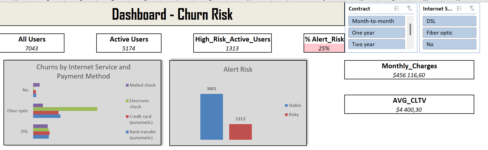
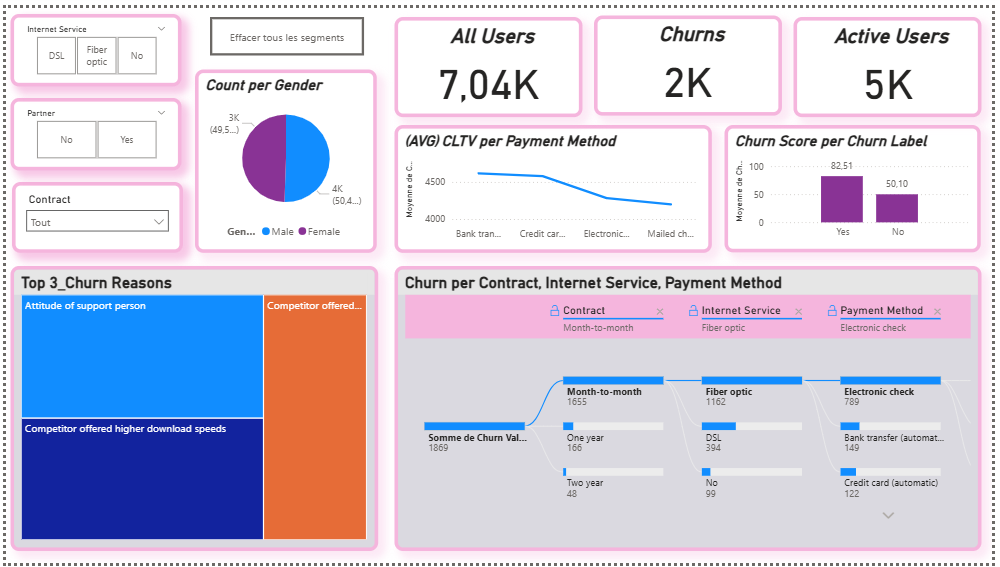

# 📊 Telco Customer Churn Analysis — Data & Product Strategy

## 🧠 Contexte du projet

Dans le secteur des télécommunications, la fidélisation client est un enjeu majeur. Ce projet vise à analyser les causes de résiliation (churn) en utilisant un jeu de données client fictif issu d’un opérateur Telco. L'objectif est d'identifier les profils à risque et proposer des **actions produit et marketing concrètes** pour améliorer la rétention.

---

## 🎯 Objectifs

- Comprendre les facteurs qui influencent le churn client
- Segmenter les clients selon leur risque de churn
- Proposer des recommandations stratégiques basées sur les insights data
- Valoriser l’analyse dans une démarche portfolio orientée produit & data

---

## 🧰 Données utilisées

- **Fichier source** : `Telco_customer_churn.xlsx`
- **Nombre de lignes** : 7 043 clients
- **Variables clés** :
  - Données démographiques : âge, genre, statut marital
  - Données de service : type d'abonnement, options Internet, TV, service client
  - Données financières : montant mensuel, durée d'abonnement
  - Cible : `Churn` (Oui / Non)

---

## ⚙️ Méthodologie

1. **Nettoyage des données** : suppression des valeurs manquantes, conversion des types
2. **Analyse descriptive** : statistiques de base, visualisation des variables
3. **Segmentation** : comparaison churn vs non-churn sur les principales variables
4. **Visualisations** : création d’un dashboard Excel & Power BI pour faciliter la lecture
5. **Recommandations** : traduction des résultats en actions concrètes

---

## 📊 Visualisations clés

### 📈 Dashboard Excel

Ce tableau de bord montre les indicateurs clés du churn par :
- Type de contrat
- Revenu mensuel
- Durée de l’abonnement
- Services souscrits

---

### 📊 Dashboard Power BI

Dashboard interactif simulé (capture d’écran) avec :
- Filtrage par profil client
- Analyse croisée churn vs services
- Représentation visuelle par heatmaps et bar charts

---

## 🔍 Insights clés & Recommandations

### 🔸 Insight 1 : Le churn est plus élevé chez les clients avec un contrat mensuel

- **% de churn chez les clients “Month-to-month”** : ~43%
- **% de churn chez les clients “Two year”** : ~11%

**💡 Recommandation Produit/Marketing** :
- Mettre en avant les avantages des contrats longue durée (tarif réduit, bonus de fidélité)
- Créer des campagnes de transition vers des abonnements annuels avec offres limitées

---

### 🔸 Insight 2 : Le churn est plus important chez les utilisateurs de services Internet fibre

- Les clients avec une connexion fibre ont un taux de churn > 40%

**💡 Recommandation Produit** :
- Auditer la qualité de service fibre (délais, incidents) et la comparer à l'ADSL
- Mettre en place un système de feedback client spécifique sur la qualité Internet

---

### 🔸 Insight 3 : Les clients ayant souscrit à peu de services (pas de TV, pas de sécurité) churnent plus

- Churn plus élevé pour les clients mono-service

**💡 Recommandation Marketing** :
- Proposer des bundles multi-services attractifs
- Créer une campagne “upgrade” incitative via email/SMS/app mobile

---

### 🔸 Insight 4 : Les clients ayant contacté le service client plus d'une fois ont un taux de churn plus élevé

- Taux de churn > 50% pour ceux ayant eu 2+ interactions

**💡 Recommandation Produit** :
- Auditer les causes de contact (problèmes techniques, facturation, etc.)
- Renforcer le support proactif via chatbot, FAQ interactive, app selfcare

---

### 🔸 Insight 5 : Les jeunes clients (moins de 30 ans) churnent davantage

- Segment plus volatile, moins fidèle, plus sensible au prix et à l’innovation

**💡 Recommandation Marketing** :
- Mettre en place une offre jeune : tarif étudiant, bonus fidélité 6 mois, offres mobiles-first
- Expérimenter une stratégie d’engagement via TikTok, Instagram, WhatsApp

---

## 🧩 Conclusion

Cette analyse démontre comment une lecture approfondie des données peut orienter des décisions stratégiques produit et marketing. L’approche est duplicable à d’autres secteurs et renforce la synergie entre analyse de données et stratégie client.

---

## 📁 Fichiers liés

- `Telco_customer_churn.xlsx` — Source des données
- `Dashboard_Excel.png` — Aperçu du dashboard Excel
- `Dashboard_PowerBI.png` — Dashboard Power BI interactif

---

## 🧑‍💼 Réalisé par

Marc-Gaël ZEME  
*Product & Data Strategist* — [LinkedIn](https://www.linkedin.com/) | [GitHub](https://github.com/)  
